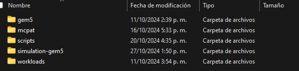

# Simulación de Microarquitecturas con Gem5 y McPAT

Este es el repositorio para la entrega del trabajo de simulación de microarquitecturas para el curso de Arquitecturas Avanzadas de computadores 2024-2.

## Cómo usar:

Para usar el algoritmo desarrollado se debe clonar el repositorio dentro de la carpeta ~/mySimTools. Asegurarse que las carpetas tengan los siguientes nombres y contenidos para el correcto funcionamiento del algoritmo:

  

  
## Desarrollado por:

Camilo Alvarez Muñoz: camilo.alvarezm@udea.edu.co

Daniel Cano Restrepo: daniel.canor1@udea.edu.co